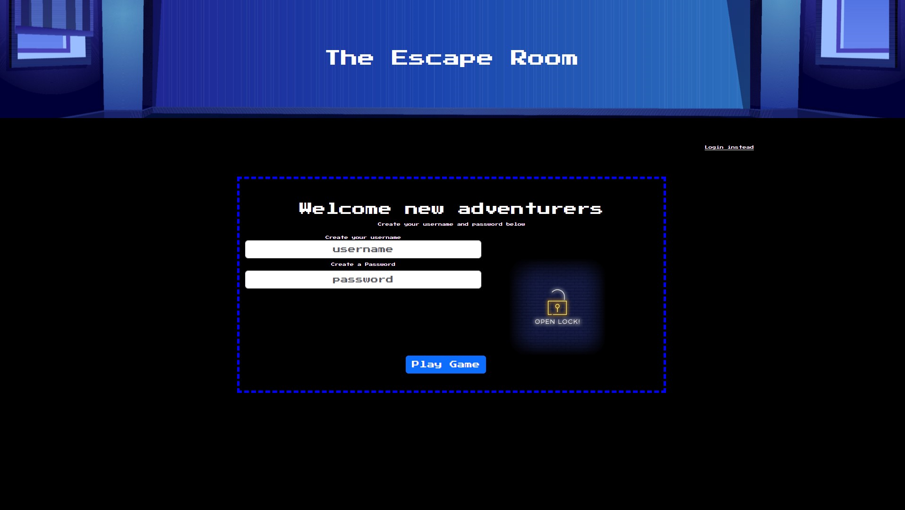

# The-Escape-Room

## Deployed Links:
https://github.com/Group-2-Project-Two/The-Escape-Room

## Screenshots:

## Description:
    As a group, we wanted to create a small and fun choose your own adventure game similar to the goosebumps books but with a retro video game feel.  After creating a user, you are prompted with choices. These choices change the possible outcomes of the game by either advancing you further along or making you start all over.

## User Story:
    As a user,
    When i load the page
    Then I create an account 
    When I advance the page
    Then I am presented with two choices
    When I choose correctly 
    Then I advance further into the game
    When I choose incorrectly
    Then the game is over, back to start

## Resources: 

Bcrypt: https://www.npmjs.com/package/bcrypt

Typewriter effect: https://css-tricks.com/snippets/css/typewriter-effect/

https://www.passportjs.org/tutorials/password/session/

Deploying to heroku: https://www.bezkoder.com/deploy-node-js-app-heroku-cleardb-mysql/

Seeding mySQL: https://stackoverflow.com/questions/69196421/seed-mysql-database-on-heroku

Typewriter reference; https://www.youtube.com/watch?v=MiTJnYHX3iA
